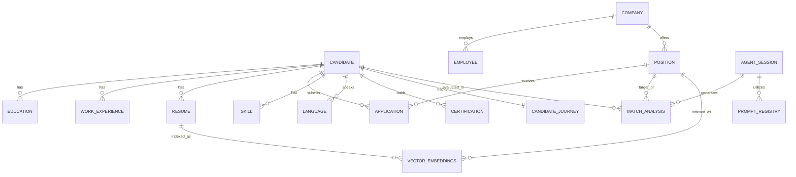

# JobFinder: Hybrid Data Model Specification

## 1. Architectural Overview
JobFinder utilizes **Polyglot Persistence** to manage different types of information:
- **Relational Domain (PostgreSQL)**: Source of truth for user profiles, recruitment entities, and final application states.
- **Vector Domain (Vector DB)**: High-dimensional embeddings for RAG (Retrieval Augmented Generation) to allow agents to perform semantic search over CVs and Job Descriptions.
- **Agentic Domain (State/Session)**: Short-term memory, reasoning traces, and non-deterministic state management.

---

## 2. Relational Domain (The Foundation)

### 2.1 Core Candidate Entities

**1. Candidate**
Represents a job candidate who can apply for positions within the system.
- id: Unique identifier for the candidate (Primary Key)
- firstName: Candidate's first name (max 100 characters)
- lastName: Candidate's last name (max 100 characters)
- email: Candidate's unique email address (max 255 characters) — this is the login credential (`POST /auth/register`/`login`). It is never modified by CV extraction; a resume's own reported email (which may differ) is stored on that `Resume` record instead (see Resume entity below).
- phone: Candidate's phone number (optional, max 15 characters)
- address: Candidate's address (optional, max 100 characters)
- passwordHash: Bcrypt hash of the candidate's password (cost factor 12, max 255 characters). Never the plain-text password.
- emailVerifiedAt: Timestamp when the candidate proved ownership of `email` by clicking their one-time verification link (optional, null until verified). `requireAuth` rejects every protected route with `403` while this is unset, regardless of session validity — see `candidate-authentication`'s "Session-Based Route Protection" requirement.
- **Validation Rules**: First name and last name are required, 2-100 characters, letters only; Email is required, must be unique; Phone is optional but must follow Spanish format (6|7|9)XXXXXXXX; Address is optional, max 100 characters; passwordHash is required, set at registration (`POST /auth/register`), never accepted or returned directly by any API response; emailVerifiedAt is optional, set only by `POST /auth/verify-email` consuming a valid one-time token.
- **Relationships**: educations (1:N), workExperiences (1:N), resumes (1:N), applications (1:N), skills (1:N), languages (1:N), certifications (1:N).

**2. Education**
Represents educational background information for candidates.
- id: Unique identifier for the education record (Primary Key)
- institution: Name of the educational institution (max 100 characters)
- title: Degree or certification title obtained (max 250 characters)
- startDate: Start date of the education period (optional — some CVs state only an end/graduation date)
- endDate: End date of the education period (optional, null if ongoing)
- candidateId: Foreign key referencing the Candidate
- **Validation Rules**: Institution required (max 100), Title required (max 250), start date and end date both optional. Max 3 education records per candidate.
- **Relationships**: candidate (N:1).

**3. WorkExperience**
Represents work history and professional experience for candidates.
- id: Unique identifier for the work experience record (Primary Key)
- company: Name of the company or organization (max 100 characters)
- position: Job title or position held (max 100 characters)
- description: Description of responsibilities and achievements (optional, unbounded length — a real CV's job description exceeded the original 200-character limit, see cv-upload-hardening)
- startDate: Start date of the work experience
- endDate: End date of the work experience (optional, null if current)
- candidateId: Foreign key referencing the Candidate
- **Validation Rules**: Company name required (max 100), Position required (max 100), Description optional (unbounded), Start date required.
- **Relationships**: candidate (N:1), responsibilities (1:N), projects (1:N).

**4. WorkExperienceResponsibility**
Represents a single role-level duty within a `WorkExperience`, distinct from a specific `Project`'s own achievements (see below). work-experience-detail: `description` alone gave the extraction pipeline nowhere structured to put this.
- id: Unique identifier for the responsibility record (Primary Key)
- text: The responsibility/duty text (unbounded length)
- workExperienceId: Foreign key referencing the WorkExperience
- **Validation Rules**: Text required. Deleted automatically when its `WorkExperience` is deleted (`onDelete: Cascade`).
- **Relationships**: workExperience (N:1).

**5. Project**
Represents a specific initiative within a `WorkExperience` — distinct from the role's general responsibilities above.
- id: Unique identifier for the project record (Primary Key)
- name: Project name (max 300 characters)
- description: Project description (optional, unbounded length)
- workExperienceId: Foreign key referencing the WorkExperience
- **Validation Rules**: Name required (max 300), description optional. Deleted automatically when its `WorkExperience` is deleted (`onDelete: Cascade`).
- **Relationships**: workExperience (N:1), achievements (1:N), stack (1:N).

**6. ProjectAchievement**
Represents a single achievement/result for a specific `Project`.
- id: Unique identifier for the achievement record (Primary Key)
- text: The achievement text (unbounded length)
- projectId: Foreign key referencing the Project
- **Validation Rules**: Text required. Deleted automatically when its `Project` is deleted (`onDelete: Cascade`).
- **Relationships**: project (N:1).

**7. ProjectStackItem**
Represents a single technology used on a specific `Project` — deliberately independent from `Skill` (CV-mined, per-project usage, not the candidate's self-reported aggregate skill list; no shared taxonomy).
- id: Unique identifier for the stack item record (Primary Key)
- name: Technology/tool name (max 100 characters)
- projectId: Foreign key referencing the Project
- **Validation Rules**: Name required (max 100). Deleted automatically when its `Project` is deleted (`onDelete: Cascade`).
- **Relationships**: project (N:1).

**8. Resume**
Represents uploaded resume files associated with candidates.
- id: Unique identifier for the resume record (Primary Key)
- filePath: File system path to the uploaded resume (max 500 characters)
- fileType: MIME type or file extension of the resume (max 50 characters)
- uploadDate: Date and time when the resume was uploaded
- extractedFirstName: First name as reported in this specific resume (optional, max 100 characters)
- extractedLastName: Last name as reported in this specific resume (optional, max 100 characters)
- extractedEmail: Email as reported in this specific resume (optional, max 255 characters) — a candidate may hold several resumes reporting different or no contact info; this is never written onto `Candidate.email`, which is the login credential. If it differs from the candidate's account email, the UI surfaces a non-blocking notice.
- extractedPhone: Phone as reported in this specific resume (optional, max 15 characters)
- extractedAddress: Address as reported in this specific resume (optional, max 100 characters)
- candidateId: Foreign key referencing the Candidate
- **Validation Rules**: File path required (max 500), File type required (max 50). Supported types: PDF and DOCX (max 10MB). All `extracted*` fields are optional — extraction may fail or a resume may omit a field.
- **Relationships**: candidate (N:1).

**9. Skill**
Represents a technical or soft skill extracted from a candidate's resume.
- id: Unique identifier for the skill record (Primary Key)
- name: Skill name, e.g. "Python", "Communication" (max 100 characters)
- type: Skill category — `technical` or `soft`
- proficiency: Stated mastery level, e.g. "Advanced", "Intermediate" (optional, free text, max 50 characters) — distinct from `type`, which only ever classifies the kind of skill
- candidateId: Foreign key referencing the Candidate
- **Validation Rules**: Name required (max 100), type required (one of `technical`, `soft`), proficiency optional. No maximum record count per candidate.
- **Relationships**: candidate (N:1).

**10. Language**
Represents a language the candidate speaks, with optional proficiency.
- id: Unique identifier for the language record (Primary Key)
- name: Language name, e.g. "English", "Spanish" (max 50 characters)
- proficiency: Proficiency level, e.g. "native", "fluent", "intermediate" (optional, free text, max 50 characters)
- candidateId: Foreign key referencing the Candidate
- **Validation Rules**: Name required (max 50), proficiency optional. No maximum record count per candidate.
- **Relationships**: candidate (N:1).

**11. Certification**
Represents a professional certification held by the candidate.
- id: Unique identifier for the certification record (Primary Key)
- name: Certification name (max 150 characters)
- issuer: Issuing organization (optional, max 150 characters)
- issueDate: Date the certification was issued (optional)
- candidateId: Foreign key referencing the Candidate
- **Validation Rules**: Name required (max 150), issuer and issueDate optional. No maximum record count per candidate.
- **Relationships**: candidate (N:1).

### 2.2 Recruitment & Company Entities

**12. Company**
Represents companies that post job positions and employ staff.
- id: Unique identifier for the company (Primary Key)
- name: Unique company name
- **Relationships**: employees (1:N), positions (1:N).

**13. Employee**
Represents employees within companies who can conduct interviews.
- id: Unique identifier for the employee (Primary Key)
- name: Employee's full name
- email: Employee's unique email address
- role: Employee's role or job title
- isActive: Boolean indicating if the employee is currently active
- companyId: Foreign key referencing the Company
- **Relationships**: company (N:1), interviews (1:N).

**14. InterviewType**
Defines different types of interviews that can be conducted.
- id: Unique identifier for the interview type (Primary Key)
- name: Name of the interview type (e.g., Technical, Behavioral, HR)
- description: Detailed description of the interview type
- **Relationships**: interviewSteps (1:N).

**15. InterviewFlow**
Represents a sequence of interview steps for a specific hiring process.
- id: Unique identifier for the interview flow (Primary Key)
- description: Description of the flow's purpose and structure
- **Relationships**: interviewSteps (1:N), positions (1:N).

**16. InterviewStep**
Represents a specific step within an interview flow.
- id: Unique identifier for the interview step (Primary Key)
- name: Name of the step (e.g., First Screening, Technical Panel)
- orderIndex: The sequence number of the step in the flow
- interviewFlowId: Foreign key referencing the InterviewFlow
- interviewTypeId: Foreign key referencing the InterviewType
- **Relationships**: interviewFlow (N:1), interviewType (N:1), applications (1:N), interviews (1:N).

**17. Position**
Represents a job opening that candidates can apply for.
- id: Unique identifier for the position (Primary Key)
- title: Job title (max 200 characters)
- description: Full job description
- status: Status of the position (e.g., Open, Closed, Draft)
- isVisible: Boolean indicating if the position is public
- location: Physical or remote location of the job
- jobDescription: Detailed job description for matching
- requirements: List of technical and soft requirements
- responsibilities: Main duties and responsibilities
- salaryMin: Minimum salary for the position
- salaryMax: Maximum salary for the position
- employmentType: Type of employment (e.g., Full-time, Part-time, Contract)
- benefits: List of benefits offered
- companyDescription: Brief description of the company
- applicationDeadline: Deadline for submitting applications
- contactInfo: Contact information for the recruiter
- companyId: Foreign key referencing the Company
- interviewFlowId: Foreign key referencing the InterviewFlow
- **Relationships**: company (N:1), interviewFlow (N:1), applications (1:N).

**18. Application**
Represents a candidate's application for a specific position.
- id: Unique identifier for the application (Primary Key)
- applicationDate: Date and time of application
- currentInterviewStep: Current step the candidate is at in the process
- notes: Internal notes regarding the application
- positionId: Foreign key referencing the Position
- candidateId: Foreign key referencing the Candidate
- interviewStepId: Foreign key referencing the InterviewStep
- **Relationships**: position (N:1), candidate (N:1), interviewStep (N:1), interviews (1:N).

**19. Interview**
Represents individual interview sessions conducted as part of an application.
- id: Unique identifier for the interview (Primary Key)
- interviewDate: Date and time of the interview
- result: Interview result or outcome (optional)
- score: Numeric score or rating from the interview (optional)
- notes: Interview notes and feedback (optional)
- applicationId: Foreign key referencing the Application
- interviewStepId: Foreign key referencing the InterviewStep
- employeeId: Foreign key referencing the conducting Employee
- **Relationships**: application (N:1), interviewStep (N:1), employee (N:1).

---

## 3. Agentic Extensions (The Intelligence Layer)

### 3.1 Analysis & Matching
**MatchAnalysis**
- id: UUID (PK)
- candidateId: UUID (FK $\rightarrow$ Candidate)
- positionId: UUID (FK $\rightarrow$ Position)
- score: Float (0-10)
- justification: Text (Detailed reasoning provided by the Matchmaker Agent)
- identifiedGaps: JSONB (List of missing skills and requirements)
- createdAt: DateTime

**CandidateJourney**
- id: UUID (PK)
- candidateId: UUID (FK $\rightarrow$ Candidate)
- currentStage: Enum (Pre-Application, Application, Interview, Follow-up)
- actionPlan: JSONB (Structured plan generated by the Career Coach agent)
- milestones: JSONB (Completed vs Pending activities)
- updatedAt: DateTime

### 3.2 AI Memory & Orchestration
**AgentSession**
- sessionId: UUID (PK)
- agentHistory: JSONB (Log of agent transitions and tool calls)
- contextSummary: Text (Compressed memory of the current interaction)
- activeGoal: String (The specific objective currently being pursued)

**PromptRegistry**
- id: UUID (PK)
- agentRole: Enum (Orchestrator, Matchmaker, CV_Analyst, Coach)
- promptTemplate: Text (The actual prompt used)
- version: String (e.g., v1.0.2)
- isActive: Boolean

---

## 4. Vector Domain (RAG Knowledge Base)
Managed in a Vector Database (e.g., ChromaDB/Pinecone).

- **Collection: resumes_embeddings**
    - vector: Array<Float>
    - metadata: { "candidateId": "uuid", "chunk_index": 0, "section": "skills" }
    - text: String (Original fragment)

- **Collection: job_descriptions_embeddings**
    - vector: Array<Float>
    - metadata: { "positionId": "uuid", "section": "requirements" }
    - text: String (Original fragment)

---

## 5. Entity Relationship Diagram (Combined)

## 6. Key Design Principles
1. **Relational Integrity**: Core data follows strict normalization to prevent redundancy.
2. **Symmetry**: The Vector DB must stay synced with the Relational DB.
3. **Traceability**: Every AI-generated score or plan must be linked to an AgentSession.
4. **Type Safety**: All data flowing from Relational $\rightarrow$ Agentic Core must be validated via Pydantic models.
