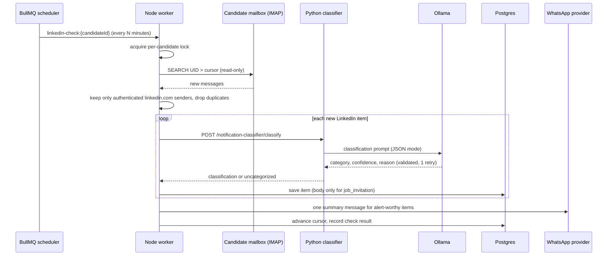

## Context

See proposal.md - Why. Current state this builds on:

- `respond-to-job-invitation` (not yet merged) drafts replies from pasted text and persists `JobInvitation` with `source` (`manual_text`, `linkedin_message`, `linkedin_notification`) and a nullable `externalId`, unique per `(candidateId, source, externalId)`. Its worker, queue and Python agent are the pattern reused here.
- Stack: Node API gateway (Express, Prisma, BullMQ/Redis), Python agent core (FastAPI) calling local Ollama (`llama3:8b`, 8192-token ceiling), React frontend. The Python core never touches Postgres.
- `nodemailer` exists for outbound e-mail only; there is no inbound mail, scheduler, WhatsApp, or encrypted-secret code yet.

**External constraints that shape the design (verified 2026-10-07):**
- LinkedIn's Messages API is restricted to approved partners and its User Agreement prohibits bots and unauthorized automated access to the service. Reading a member's inbox through the site, a headless browser or a session cookie would put the candidate's account at risk and is excluded.
- WhatsApp Business Platform only allows business-initiated messages to opted-in users, and outside a 24-hour customer-service window only pre-approved message templates can be sent.

## Goals / Non-Goals

**Goals:**
- Detect LinkedIn notifications and direct messages without violating LinkedIn's terms.
- Classify each into social / job invitation / sponsored, locally (Ollama), with graceful degradation.
- Configurable check frequency; WhatsApp alert with verified consent and minimal content.
- Hand job invitations to the existing reply-draft flow with no duplicate processing.

**Non-Goals:**
- Direct LinkedIn access of any kind; replying or sending anything on LinkedIn.
- Sending the drafted reply anywhere.
- OAuth mailbox connection (IMAP with an app password first), quiet hours, multi-account, two-way WhatsApp chat.

## Decisions

**1. Ingestion through a `NotificationSource` adapter; v1 reads the candidate's mailbox over IMAP.** LinkedIn already e-mails the candidate for new messages, invitations and notifications, so the candidate's inbox is a legitimate, consented copy of that feed. The adapter interface (`fetchSince(cursor) -> RawMessage[]`) keeps the check pipeline independent of the source; a browser-extension or manual-forward adapter can be added later with no change to classification, notification or UI. The source enum on records (`linkedin_message`, `linkedin_notification`) describes the *kind* of LinkedIn item, not the transport. *Alternatives rejected:* scraping/automation (prohibited, fragile), LinkedIn partner API (not obtainable by an individual project), Gmail OAuth (more approvals/complexity than an app password for a first version).

**2. Mailbox is read-only and cursor-based.** Open the inbox read-only (`EXAMINE`), search by UID greater than the stored cursor, never set flags. The cursor (`lastSeenUid` + `uidValidity`) advances only after the whole check commits, so a failed check re-reads the same period. If `uidValidity` changes, fall back to the last-check date instead of reprocessing the mailbox. First enable sets the cursor to "now" (no history flood).

**3. Authenticity filter before any LLM call.** A message is a LinkedIn item only if the From domain is `linkedin.com` (or a subdomain) *and* the receiving server's `Authentication-Results` shows DKIM or SPF pass for that domain. This keeps spoofed mail and prompt-injection payloads away from the classifier and keeps unrelated mailbox content from being read at all.

**4. One recurring job per candidate via a BullMQ job scheduler.** Enabling or changing the frequency calls an idempotent upsert of the scheduler `linkedin-check:{candidateId}` with `every = minutes`; disabling removes it. A per-candidate lock (Redis) enforces no overlapping checks, which also covers "check now". This reuses the existing Redis/BullMQ infrastructure and survives restarts without a separate cron service. Check pipeline: fetch -> authenticity filter -> de-duplicate -> classify each -> persist -> notify -> advance cursor.

**5. Classification: one focused LLM call per new item, plus cheap hints.** The Python `notification_classifier` agent returns `{category, confidence, reason}` validated by Pydantic, one retry with a capped prompt (same pattern as the CV and invitation agents), then `uncategorized`. The prompt receives sender, subject and a body truncated to ~1500 characters and is told the text is data, not instructions. Header hints that LinkedIn adds to sponsored/InMail e-mails are passed as hints to the model rather than hard rules, because their exact form must be confirmed against real samples (Open Question 3). Below 0.5 confidence the item is `uncategorized` and the guess is shown as a suggestion. Items are classified sequentially to keep a single local model responsive.

**6. Data minimization.** Only `job_invitation` bodies are stored (<= 5000 chars, the existing `invitationText` limit); other categories keep metadata only. WhatsApp alerts carry category + sender + link by default; an opt-in 80-character snippet applies only to job invitations. This limits third-party personal data persisted locally and sent to Meta.

**7. Mailbox password encrypted with AES-256-GCM** using `CREDENTIALS_ENCRYPTION_KEY` (32-byte key from env); stored as `iv.tag.ciphertext`. Never returned or logged; the API exposes only `connected` and non-secret fields. Missing key fails closed. Key rotation is out of scope (documented).

**8. WhatsApp through a `WhatsAppProvider` interface.** v1 implementation: WhatsApp Business Platform (Cloud API) sending two approved templates: `verification_code` and `linkedin_alert`. Template-only sending sidesteps the 24-hour window, since JobFinder is always business-initiated. The candidate's opt-in is the verified registration (code, 10 min expiry, 5 attempts, stored hashed). One summary message per check, never one per item, to avoid spam and cost. Delivery failures leave items un-notified for the next check; 3 consecutive failures pause alerts until re-verification.

**9. Persistence.** `linkedin_monitor_settings` (one row per candidate): enabled, frequency, profile URL, IMAP host/port/security/username, encrypted password, cursor, last check time/outcome, consecutive failures, connection state, WhatsApp number/verification state/hashed code/expiry/attempts, alert preferences, snippet option, consecutive delivery failures. `linkedin_notifications`: sender, subject, receivedAt, source, externalId, category + confidence + reason (automatic), `categoryOverride`, suggestion, body (job invitations only), `notifiedAt`, FK to optional `JobInvitation`. Unique `(candidateId, source, externalId)` gives idempotency at the database level.

**10. Reply draft reuses the existing flow.** `POST /linkedin-notifications/{id}/reply-draft` creates the `JobInvitation` (source/externalId copied from the notification) and enqueues the existing job; the frontend then reuses the polling and result components from the Invitation Replies page. Depends on `respond-to-job-invitation` being merged first.

**11. Failure policy.** A check failure never loses messages (cursor unchanged) and never blocks other candidates (per-candidate jobs). After 3 consecutive failures the connection goes to `error`, the schedule is removed and, if WhatsApp is verified, one "reconnect your mailbox" alert is sent. No infinite retry.

## Interaction Flow

## Risks / Trade-offs

- **E-mail notification format is unverified.** The sender addresses, headers (including sponsored markers), and how much message text LinkedIn includes in the e-mail are assumptions until checked against real samples; if the e-mail carries only a teaser, `job_invitation` bodies will be too short to draft from -> mitigated by Open Question 3 and by showing the candidate a link to open the message on LinkedIn. Candidates must also have LinkedIn e-mail notifications turned on.
- **Latency is bounded by e-mail delivery plus the check interval**, not real time.
- **App-password IMAP** is less convenient than OAuth and some providers disable it; accepted for v1, OAuth is a follow-up adapter.
- **Local LLM misclassification** (e.g. a personalized sponsored message that reads like an invitation) -> confidence threshold, `uncategorized` fallback, manual override, and fixtures built from real samples.
- **WhatsApp operational cost and setup** (business account, template approval) are external lead-time items, not code.
- **Sensitive data:** the IMAP password and third-party messages. Mitigated by encryption, read-only access, authenticity filter, body minimization, and no secrets in logs.

## Migration Plan

1. Additive Prisma migration: `linkedin_monitor_settings`, `linkedin_notifications`, new enums.
2. Provision `CREDENTIALS_ENCRYPTION_KEY` and WhatsApp provider secrets before enabling the feature; the monitor endpoints refuse to save credentials without the key.
3. Deploy agent endpoint, then Node routes/worker/scheduler, then frontend pages.
4. Rollback: remove the schedulers (disable all monitors), then the routes; tables are additive and can remain unused.

## Open Questions

1. **Ingestion method** — is the mailbox (IMAP) connection acceptable as the v1 way to "connect to LinkedIn", given LinkedIn offers no permitted direct access? (Changes what is built.)
2. **WhatsApp provider** — WhatsApp Business Platform (Cloud API, template approval required) vs. Twilio's WhatsApp API (faster sandbox for development, per-message cost, same template rules). (Changes the adapter and the setup.)
3. **Sample e-mails** — can the candidate provide 5-10 anonymized real LinkedIn notification e-mails (message, invitation, sponsored) to build fixtures and confirm headers and body content?
